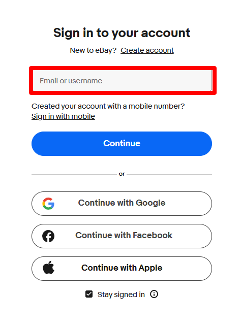
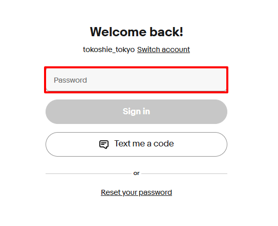
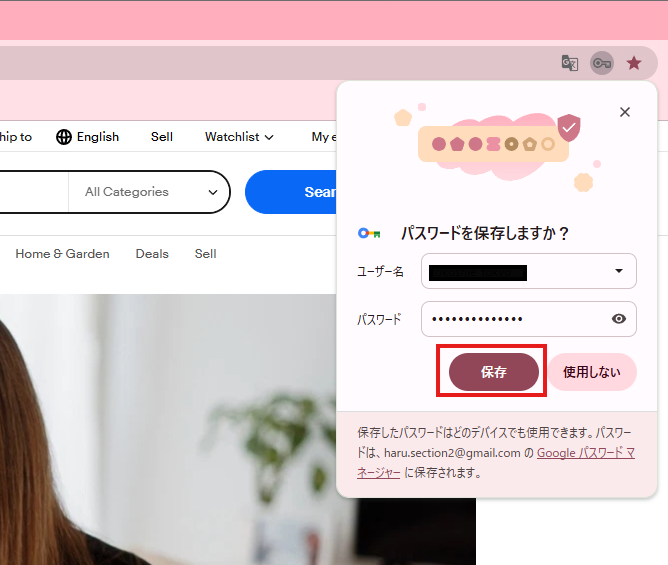

# eBayにログイン

管理者からChatworkで送付されたログイン情報を使用してログインを行ってください。

ログイン後はパスワードの保存を行っても問題ありませんが、  
絶対にパスキーは作成しないでください。

パスキーを作成すると、特定の端末にログイン情報が紐付けられてしまい、アカウント管理ができなくなる可能性があります。  
また、セキュリティ制限やアカウント制限の原因になる場合があります。

パスキー作成の案内が表示された場合は、「後で」または「スキップ」を選択してください。

---

## eBayログインページ

[eBayログインページはこちら](https://signin.ebay.com/signin/?sgfl=lgp)

---

## eBayログイン手順

### ① ユーザーネームを入力

「Email or username」の欄に、管理者から送られてきたユーザーネームを入力してください。

---

### ② パスワードを入力

パスワードを入力し、「Sign in」をクリックしてください。

---

### ③ パスワードを保存

「パスワードを保存」をクリックしてください。

---

## ログイン状態について

eBayは原則として自動ログイン状態を維持しています。

セキュリティ管理の都合上、ログアウトされていた場合は再ログインを行わず、必ず管理者へご報告ください。

外注スタッフによる再ログインはアカウント制限の原因となる場合がありますので、必ず管理者の指示に従ってください。
