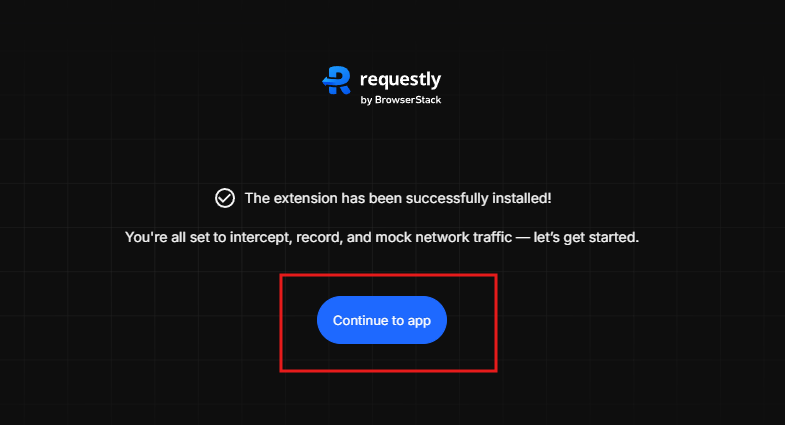
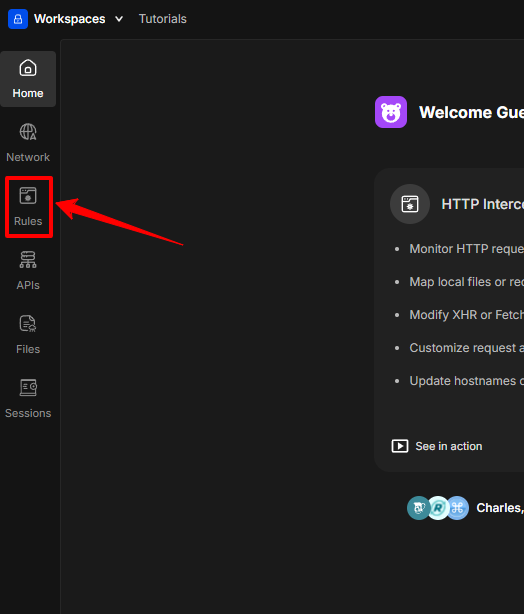
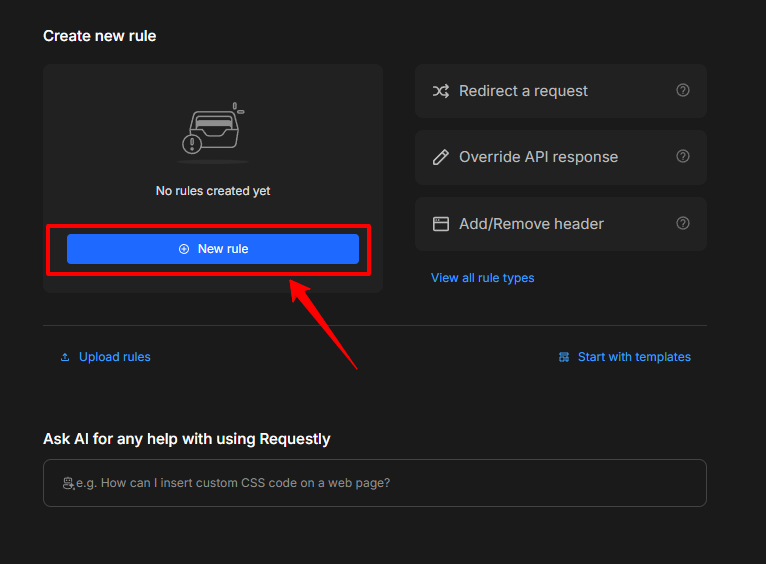
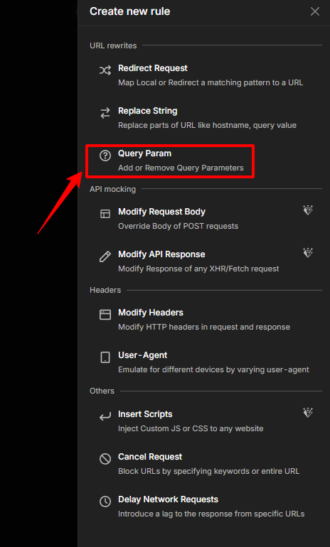
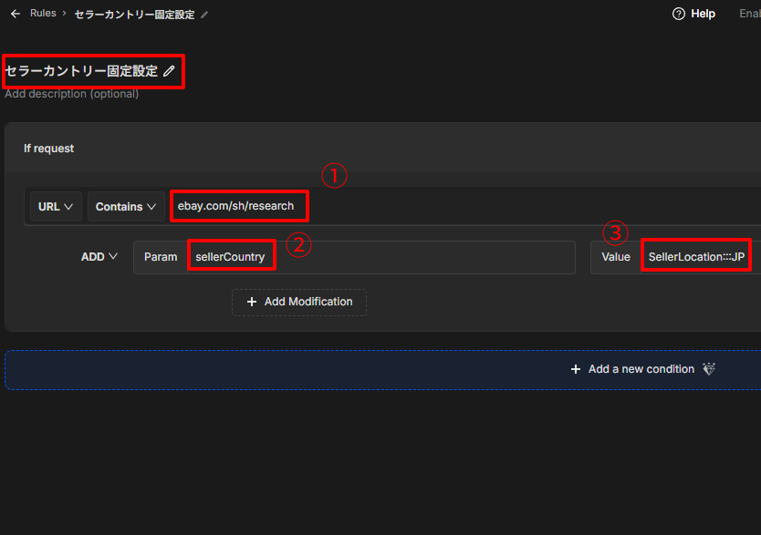
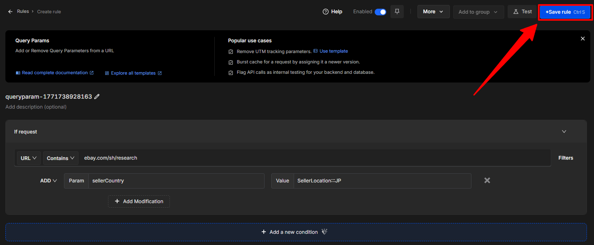
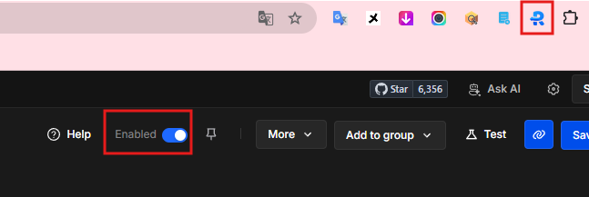
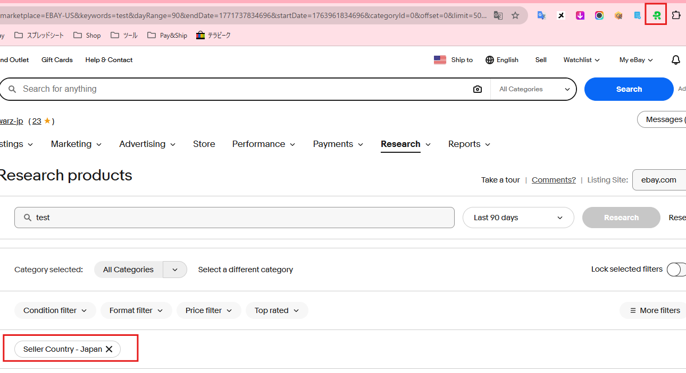
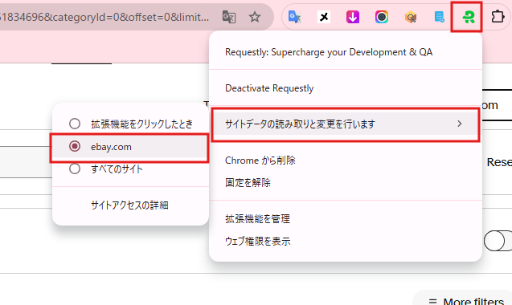

<!doctype html>
<html lang="ja">
<head>
  <meta charset="utf-8" />
  <meta name="viewport" content="width=device-width, initial-scale=1" />
  <title>各種拡張機能導入</title>
</head>
<body>

<h1>各種拡張機能導入</h1>

このページでは、リサーチ業務で使用する拡張機能について説明します。

拡張機能を導入することで、作業効率を大幅に向上させることができます。

<h2>必須拡張機能</h2>

  この項目で紹介する拡張機能は、本業務を行う上で必須となります。 
  必ず導入をお願いいたします。 
  ※①～③の拡張機能については、こちらで権限を付与しないとストアで「このアイテムはご利用いただけません」と表示されます。
  その際は管理者宛にご連絡をお願いいたします。

<h3>① ebayリサーチサポートツール</h3>

  <a href="https://chromewebstore.google.com/detail/ebay%E3%83%AA%E3%82%B5%E3%83%BC%E3%83%81%E3%82%B5%E3%83%9D%E3%83%BC%E3%83%88%E3%83%84%E3%83%BC%E3%83%AB/mchciagjfbenagabjikoannekbnphnip"
     class="chrome-btn" target="_blank" rel="noopener">🧩 Chromeウェブストアで開く</a>

仕入商品の検索作業、商品情報の取得、出品作業の支援を行うツールです。

※リサーチサポートツールについての詳細は<a href="tool_support_setup.md">コチラ</a>

<h3>② ebay送料込み価格表示</h3>

  <a href="https://chromewebstore.google.com/detail/ebay%E9%80%81%E6%96%99%E8%BE%BC%E4%BE%A1%E6%A0%BC%E8%A1%A8%E7%A4%BA/hbeapmbjnjmifoceiibcobffhgppmhge"
     class="chrome-btn" target="_blank" rel="noopener">🧩 Chromeウェブストアで開く</a>

  eBay検索画面で表示される送料を、日本円ではなくドル表示に変更する機能です。 
  導入後は特別な操作は不要です。

<h3>③ ebayとテラピークで検索</h3>

  <a href="https://chromewebstore.google.com/detail/ebay%E3%81%A8%E3%83%86%E3%83%A9%E3%83%94%E3%83%BC%E2%80%8B%E3%82%AF%E3%81%A7%E6%A4%9C%E7%B4%A2/hofiaaloaomnbcimjolifpfgkdgljibi"
     class="chrome-btn" target="_blank" rel="noopener">🧩 Chromeウェブストアで開く</a>

  テキストを選択した状態で右クリックすると、「eBayとテラピークで検索」が表示されます。 
  選択したテキストをそのまま検索に使用できます。

<h3>④ Requestly: Supercharge your Development &amp; QA</h3>

  <a href="https://chromewebstore.google.com/detail/requestly-supercharge-you/mdnleldcmiljblolnjhpnblkcekpdkpa"
     class="chrome-btn" target="_blank" rel="noopener">🧩 Chromeウェブストアで開く</a>

  テラピーク利用時にseller countryをJapanへ自動固定するための拡張機能です。 
  一度設定すれば毎回フィルターを設定する必要がなくなります。

<h4>設定手順</h4>

<ul>
  <li>「Continue to app」をクリック 
    ※この後すぐ「アカウントを作成しますか？」のようなページに移動した場合は、「作成しない」をクリックして進んでください。
  </li>
</ul>

<ul>
  <li>左側メニューから「Rules」のアイコンをクリック</li>
</ul>

<ul>
  <li>画面中央付近の青いボタン「New rule」をクリック</li>
</ul>

<ul>
  <li>右側に表示されたメニューから「Query Param」をクリック</li>
</ul>

<ul>
  <li>各入力欄に下記内容をコピーして貼り付けてください</li>
  <li>左上のルール名は自由ですが「セラーカントリー固定設定」と入力しましょう
    <ul>
      <li>URL Containsの右： ebay.com/sh/research</li>
      <li>Param Name： sellerCountry</li>
      <li>Param Value： SellerLocation:::JP</li>
    </ul>
  </li>
</ul>

<ul>
  <li>画面右上の「Save rule」をクリックして作成したルールを保存</li>
</ul>

<ul>
  <li>Enabledのチェックが青くなっていることを確認し、拡張機能はピン留めしておきましょう</li>
  <li>ここまでの作業ができたらRequestlyの設定タブは閉じて問題ありません</li>
</ul>

<ul>
  <li>テラピークで稼働テストを行います</li>
  <li>適当なキーワード検索を行い、seller countryがJapanになっていることを確認してください</li>
  <li>Requestlyが動作中はアイコンが緑に変わります</li>
</ul>

<h4>確実に行っていただきたい設定</h4>

<ul>
  <li>Requestlyアイコンを右クリック</li>
  <li>「サイトのデータの読み取りと変更を行います」→「ebay.com」を選択 
    ※この設定を行わないと、他サイト閲覧時に影響する場合があります。
  </li>
</ul>

<h2>おすすめ拡張機能</h2>

こちらは必須ではありませんが、導入することで作業効率が向上します。

<h3>① Google翻訳</h3>

  <a href="https://chromewebstore.google.com/detail/google-translate/aapbdbdomjkkjkaonfhkkikfgjllcleb"
     class="chrome-btn" target="_blank" rel="noopener">🧩 Chromeウェブストアで開く</a>

  海外サイトの商品説明や英語ページを翻訳する際に使用します。 
  英語ページを閲覧する機会が多いため、導入を推奨します。

<h3>② Insert Blurb</h3>

  <a href="https://chromewebstore.google.com/detail/insert-blurb/bkoknijjdnlaenldjopbkngkoegfmejf"
     class="chrome-btn" target="_blank" rel="noopener">🧩 Chromeウェブストアで開く</a>

  保存した定型文をワンクリックで挿入できるツールです。 
  AIへ定型文の指示を送る場合などに使用します。

※AI活用についての詳細は<a href="skill_ai.md">コチラ</a>

<h4>使い方</h4>

<ul>
  <li>文章入力欄で右クリック</li>
  <li>Insert Blurbにカーソルを合わせる</li>
  <li>保存した定型文一覧から入力したい文章を選択</li>
</ul>

<h3>③ 素晴らしい画面の並べ替えとスクリーンショット</h3>

  <a href="https://chromewebstore.google.com/detail/awesome-screen-recorder-s/nlipoenfbbikpbjkfpfillcgkoblgpmj"
     class="chrome-btn" target="_blank" rel="noopener">🧩 Chromeウェブストアで開く</a>

  ブラウザ上の指定範囲をスクリーンショットできるツールです。 
  不明点が発生した場合、作業画面を共有していただくことで問題をスムーズに解決できます。

<h4>使い方</h4>

<ul>
  <li>拡張機能アイコンをクリック</li>
</ul>

<ul>
  <li>撮影範囲を「表示部分」「フルページ」「選択範囲」から選択</li>
  <li>撮影したい範囲をドラッグし保存</li>
</ul>

<ul>
  <li>左矢印マークで画像編集が可能</li>
  <li>「Done」→「Download」で保存</li>
</ul>

</body>
</html>