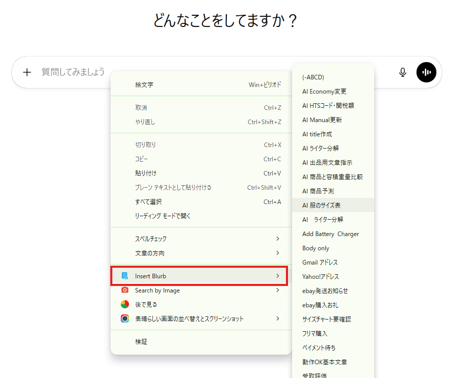
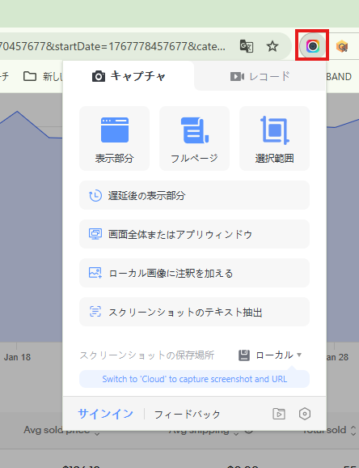
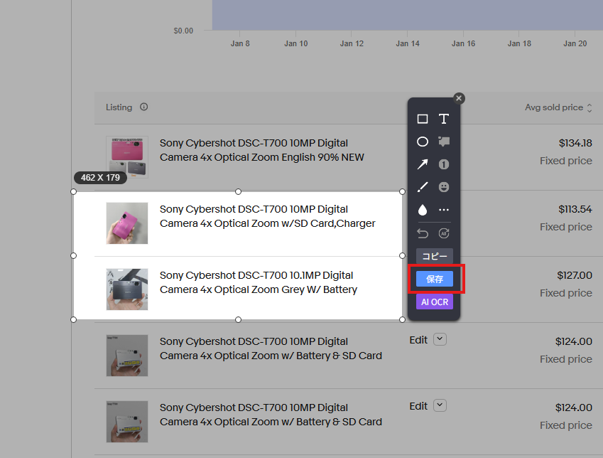
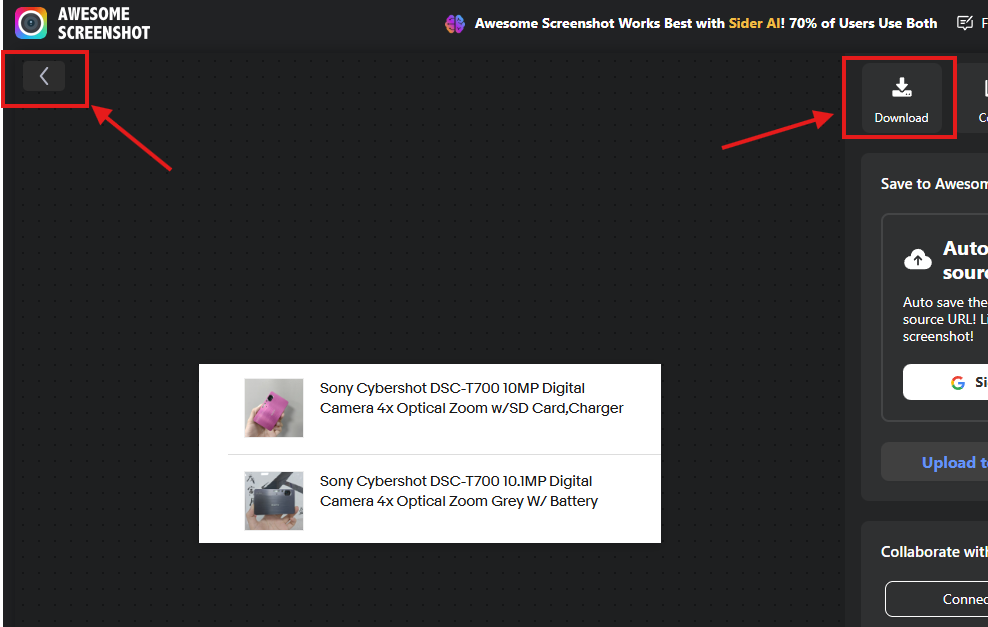

# 各種拡張機能導入

このページでは、リサーチ業務で使用する拡張機能について説明します。

拡張機能を導入することで、作業効率を大幅に向上させることができます。

---

## 必須拡張機能

この項目で紹介する拡張機能は、本業務を行う上で必須となります。  
必ず導入をお願いいたします。

---

### ① ebayリサーチサポートツール

👉 [ebayリサーチサポートツール（Chromeウェブストアはこちら）](https://chromewebstore.google.com/detail/ebay%E3%83%AA%E3%82%B5%E3%83%BC%E3%83%81%E3%82%B5%E3%83%9D%E3%83%BC%E3%83%88%E3%83%84%E3%83%BC%E3%83%AB/mchciagjfbenagabjikoannekbnphnip)

仕入商品の検索作業、商品情報の取得、出品作業の支援を行うツールです。

👉 [リサーチサポートツール初期設定](tool_support_setup.md)

---

### ② ebay送料込み価格表示

👉 [ebay送料込み価格表示（Chromeウェブストアはこちら）](https://chromewebstore.google.com/detail/ebay%E9%80%81%E6%96%99%E8%BE%BC%E4%BE%A1%E6%A0%BC%E8%A1%A8%E7%A4%BA/hbeapmbjnjmifoceiibcobffhgppmhge)

eBay検索画面で表示される送料を、日本円ではなくドル表示に変更する機能です。  
導入後は特別な操作は不要です。

---

### ③ ebayとテラピークで検索

👉 [ebayとテラピークで検索（Chromeウェブストアはこちら）](https://chromewebstore.google.com/detail/ebay%E3%81%A8%E3%83%86%E3%83%A9%E3%83%94%E3%83%BC%E3%82%AF%E3%81%A7%E6%A4%9C%E7%B4%A2/hofiaaloaomnbcimjolifpfgkdgljibi)

テキストを選択した状態で右クリックすると、「eBayとテラピークで検索」が表示されます。  
選択したテキストをそのまま検索に使用できます。

---

## おすすめ拡張機能

こちらは必須ではありませんが、導入することで作業効率が向上します。

---

### ① Google翻訳

👉 [Google翻訳（Chromeウェブストアはこちら）](https://chromewebstore.google.com/detail/google-translate/aapbdbdomjkkjkaonfhkkikfgjllcleb)

海外サイトの商品説明や英語ページを翻訳する際に使用します。  
英語ページを閲覧する機会が多いため、導入を推奨します。

---

### ② Insert Blurb

👉 [Insert Blurb（Chromeウェブストアはこちら）](https://chromewebstore.google.com/detail/insert-blurb/bkoknijjdnlaenldjopbkngkoegfmejf)

保存した定型文をワンクリックで挿入できるツールです。  
AIへ定型文の指示を送る場合などに使用します。

👉 [AI活用](skill_ai.md)

---

#### 使い方

・文章入力欄で右クリック  
・Insert Blurbにカーソルを合わせる  
・保存した定型文一覧から入力したい文章を選択  

---

### ③ 素晴らしい画面の並べ替えとスクリーンショット

👉 [Awesome Screen Recorder（Chromeウェブストアはこちら）](https://chromewebstore.google.com/detail/awesome-screen-recorder-s/nlipoenfbbikpbjkfpfillcgkoblgpmj)

ブラウザ上の指定範囲をスクリーンショットできるツールです。  
不明点が発生した場合、画面を共有することでスムーズに解決できます。

---

#### 使い方

・拡張機能アイコンをクリック  

---

・撮影範囲を「表示部分」「フルページ」「選択範囲」から選択  

・撮影したい範囲をドラッグし保存  

---

・左矢印マークで画像編集が可能  
・「Done」→「Download」で保存  

