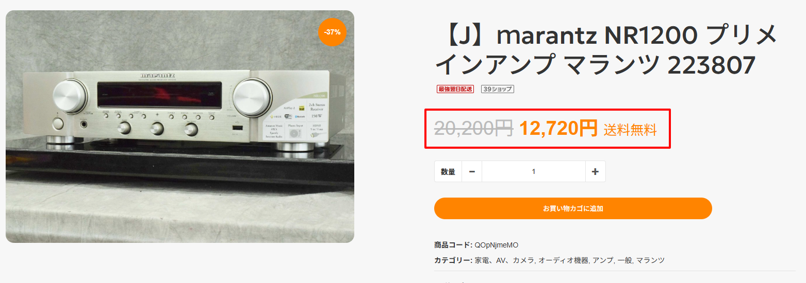
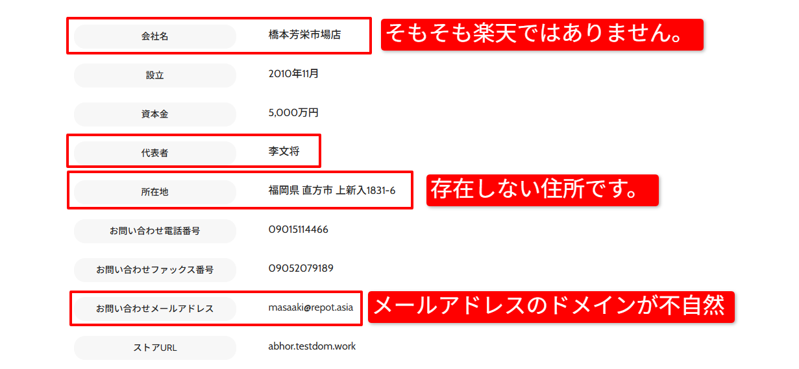
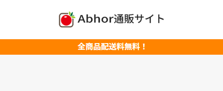
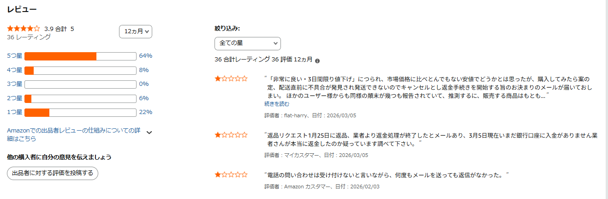
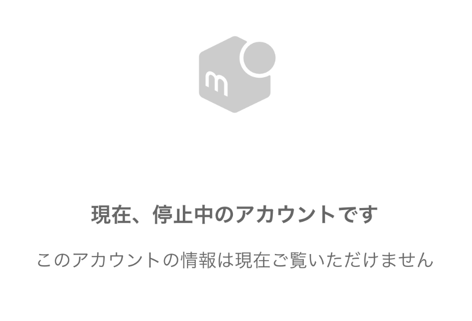
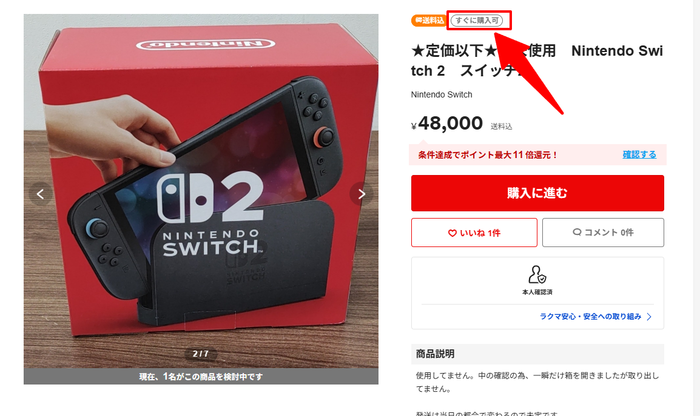

# 仕入れサイトについて

このページでは、リサーチ時に使用する仕入れサイトの注意点について解説します。

無在庫販売では、仕入れ先の選定を誤ると以下のような問題が発生します。

・商品が購入できない  
・偽物を仕入れてしまう  
・発送が遅れる  
・在庫切れになる  

これらのトラブルを防ぐため、仕入れサイトの特徴を理解しておきましょう。

---

## 詐欺サイトについて

Google検索の「ショッピング」には、通常のショップと詐欺サイトが混在して表示されることがあります。  
そのため、仕入れ先として利用してよいサイトかどうかを判断することが重要です。

詐欺サイトは、以下のポイントを確認することで多くの場合見分けることができます。

---

### ① 価格が異常に安い

詐欺サイトの最も多い特徴は、相場より極端に安い価格設定です。

多くの場合、以下のような表示がされています。

・定価に打消し線がついている  
・大幅な値下げが表示されている  
・サイト内のほぼ全商品が割引されている  

このような場合は詐欺サイトの可能性が高いため注意してください。

---

### ② 会社概要が不自然

ショップページの「会社概要」や「特定商取引法に基づく表記」も確認しましょう。

以下のような場合は注意が必要です。

・住所を検索してもGoogleマップに表示されない  
・会社名が存在しない  
・代表者名が不自然  

---

### ③ サイトデザインが簡素

詐欺サイトは短期間で作られることが多いため、サイトの作りが簡素なことがあります。

以下のような特徴がある場合は注意してください。

・ロゴやサイト名が不自然で全体的にチープな作り  
・フリマサイトから流用したような画像が多い  

---

詐欺サイトかどうか判断できない場合は、必ず管理者へ相談してください。

---

## フリマサイト・中古サイトの注意点

フリマサイトや中古販売サイトでは、  
1つのプラットフォーム内に複数の販売者が存在します。

そのため、出品者ごとに信頼性を確認する必要があります。

例

・メルカリ  
・ラクマ  
・Amazon  
・楽天市場  

---

### ① 出品者の評価を確認する

まず出品者の評価を確認しましょう。

以下の点をチェックしてください。

・評価が極端に低くないか  
・在庫切れを頻繁に起こしていないか  

安心して購入できる出品者かどうかを判断することが重要です。

判断に迷う場合は管理者へ相談してください。

---

### ② 偽ブランド商品に注意

フリマサイトでは偽物のブランド商品が出品されている場合があります。

特に以下の特徴がある場合は注意してください。

・ブランド商品が極端に安い  
・画像の作りが派手すぎる  

ブランド商品を扱う場合は、フリマサイトの絞り込み機能を活用しましょう。

例  
・安心鑑定（メルカリ）

鑑定機能を使用しても完全に安全とは限らないため注意してください。

---

### ③ 商品説明の確認

商品説明と実際の商品状態が一致しているかも重要です。

・説明では新品と書かれているが、実際の写真では使用感がある  
・コンディションの記載が曖昧  

このような場合は仕入れ対象として適さない可能性があります。

特にコンディションを確認する際  
「通電のみ確認しました」など通電した事のみの記載はジャンク品として扱ってください。

必ず「動作確認済み」の記載まで確認をお願いします。

---

## メルカリの注意点

メルカリでは、出品者のアカウントが停止された場合でも  
商品ページが残り続けることがあります。

その場合、実際には商品を購入することができません。

以下の方法で確認してください。

・「購入手続きへ」をクリックする  
・購入確認ページへ進めるか確認する  

※この操作だけでは決済は行われませんので安心してください。

アカウント停止中の場合は、以下のような表示になります。

---

## ラクマの注意点

ラクマでは「すぐに購入可」の表示がある商品のみ選択してください。

この表示がない場合、以下の流れになります。

購入申請  
↓  
出品者が承認  
↓  
購入可能

この仕組みのため、出品者が承認しない場合は購入できません。

また、相場より安い商品で申請が通らないケースも多いため注意してください。

---

## 納期について

eBayでは、商品が売れてから発送までの期間を  
**最大10営業日**に設定しています。

そのため、仕入れ先の商品は **すぐに購入できる状態であること** が重要です。

---

### 注意が必要な商品

以下の商品は仕入れ対象として適さない場合があります。

・納期が未定の商品  
・数か月後発送の商品  
・予約商品  
・受注生産商品  

商品ページに「購入ボタン」や「カートに入れる」が表示されていても、  
必ず納期の記載を確認してください。

---

少しでも判断に迷う場合は、必ず管理者へ相談してください。