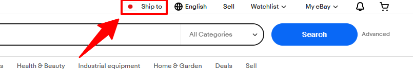
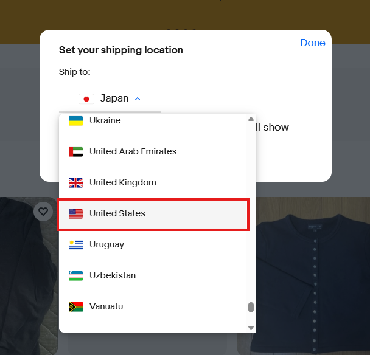
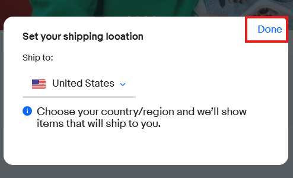

# リサーチを行う前に

このページでは、リサーチを始める前に必ず確認していただきたい重要事項について説明します。  
実践的な詳細については、次のページ以降で動画コンテンツなどを用いて詳しく解説していきます。

---

## Ship To の確認

「Ship To」の設定によっては、eBay上に商品が表示されなくなる場合があります。

Ship Toとは「商品のお届け先情報」のことです。

お届け先が日本のままリサーチを行うと、アメリカ向けの需要データを正しく確認することができません。  
その結果、実際には売れている商品を見逃したり、誤った販売判断につながる可能性があります。

リサーチを行う際には、必ずShip Toが「アメリカ」になっているか確認してください。

---

### 確認方法・設定変更方法

① 画面右上の国旗を確認

---

② 日本になっている場合は「Ship to」をクリックし、プルダウンから「United States（アメリカ）」を選択

---

③ 「Done」をクリックして適用

---

## リサーチ対象の基準

### 売れ筋商品の定義

「[eBayについて](ebay_role.md)」の「販売の基本フロー」で解説した通り、  
eBayに出品する商品は売れ筋商品であることが大前提となります。

リサーチ業務では、

過去90日間で2個以上販売されている商品をリサーチ対象

と定義しています。

やみくもに出品するのではなく、実際にeBay上で販売された実績がある商品に絞ってリサーチを行いましょう。

---

### 利益基準（リストアップ対象）

利益額が500円以上出るもののみリストアップ対象 

商品の利益は、仕入れ価格・送料・販売価格などを元に計算しますが、実際の発送時には以下のような要因によって利益が変動する可能性があります。

・発送時の送料変動  
・関税や手数料の変動  
・為替レートの変動  

これらの影響により、リサーチ時の計算上は利益が出ている商品でも、実際には利益が減少したり、赤字になる場合があります。

そのため、利益に余裕を持たせる目的で、この基準を設定しています。

安定して利益を確保するためにも、この基準を必ず守るようにしてください。

---

## SEOについての基礎知識

### SEOとは

SEOとは「検索結果に商品を表示させる仕組み」のことです。

検索結果の上位に表示される商品ほど、お客様に見てもらえる機会が増えるため、売れやすくなります。

つまり、eBayで安定して販売を行うためには、SEO対策が重要になります。

---

### リサーチ業務で意識するSEO対策

リサーチ業務において特に重要なSEO対策は、以下の2つです。

---

#### ・最安値で出品する

同じ商品が複数出品されている場合、価格が安い商品ほど購入されやすくなります。

そのため、リサーチを行う際は、

・競合商品の出品価格  
・送料込みの総額  

を必ず確認し、最安値で出品できる商品を選びましょう。

---

#### ・リサーチ基準に満たない商品は出品しない

販売実績が少ない商品や、需要が不安定な商品を出品すると、販売までに時間がかかる可能性があります。

また、販売実績が少ない商品はSEOも上がりにくく、検索結果に表示されにくくなる傾向があります。

そのため、販売実績がある商品に絞ってリサーチを行うことが重要です。

---

SEO評価が高くなると、リサーチした商品が売れやすくなります。

つまり、

SEO評価が上がる  
↓  
商品が売れやすくなる  
↓  
インセンティブ（報酬）が増える

につながります。

SEOを意識しながら、リサーチを行っていきましょう。
