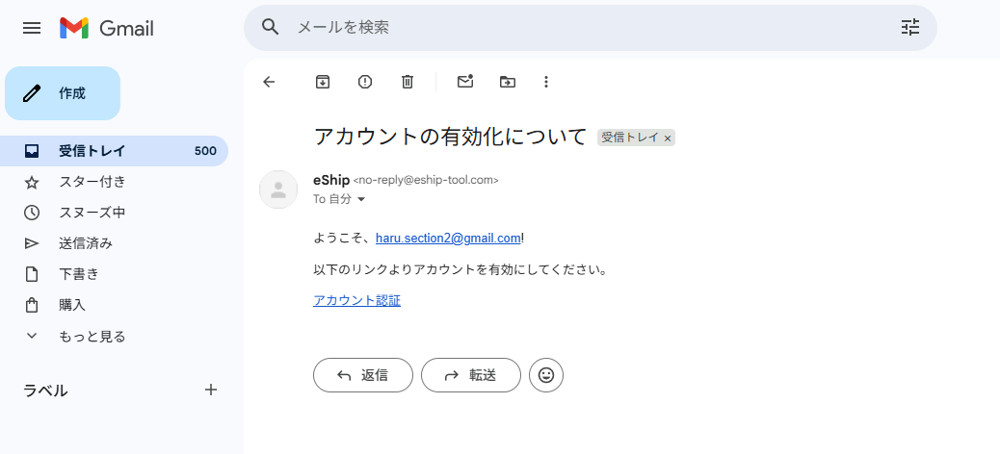
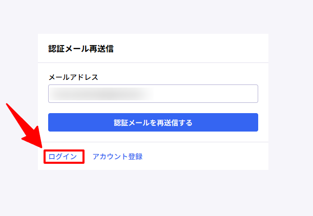
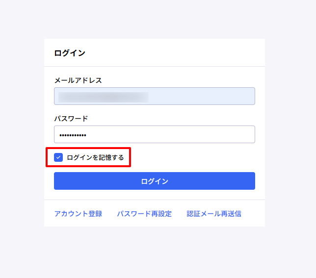
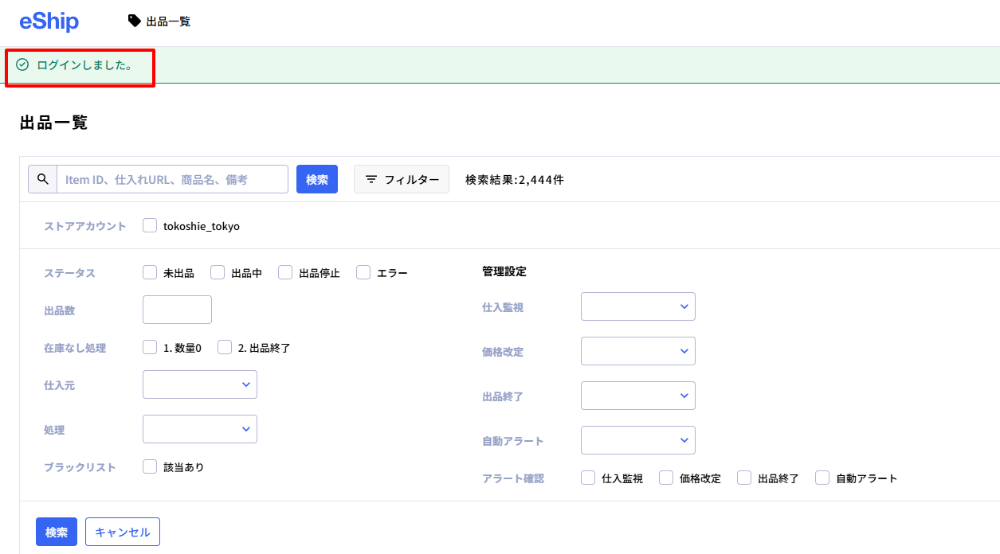

# e-shipにログイン

本項ではe-shipのログインについてご説明します。  
ログイン後はパスワードの保存を行っても問題ありません。

🚨 ログイン必須の理由

e-shipに正しくログインができていないと、リサーチサポートツールの拡張機能が動作しないためご注意ください。拡張機能については次項「各種拡張機能導入」で詳しく解説しています。

---

## e-shipログイン手順

  STEP 01
  Gmailでe-shipの招待メールを確認する

e-shipの招待メールを確認し、「アカウント有効化」をクリックしてください。

  STEP 02
  認証メール再送信画面について

画像のように「認証メール再送信」の画面になっている場合でも、アカウント申請は完了している状態です。  
そのまま「ログイン」ボタンを押してスキップしてください。

  STEP 03
  ログイン情報の入力

ご自身のGmailアドレスと、共通パスワード「**e-shipresearch**」を入力し、「ログイン」をクリックしてください。

  STEP 04
  ログイン後画面の確認

下記のようなページになり、「ログインしました」と表示されていればログイン完了です。

---

## ログインできない場合

⚠️ ログインができない場合の確認事項

次のような場合は、作業を止めて管理者へご連絡ください。

- 招待メールが届いていない  
- パスワードを入力してもログインできない  
- 画面が正常に表示されない  

