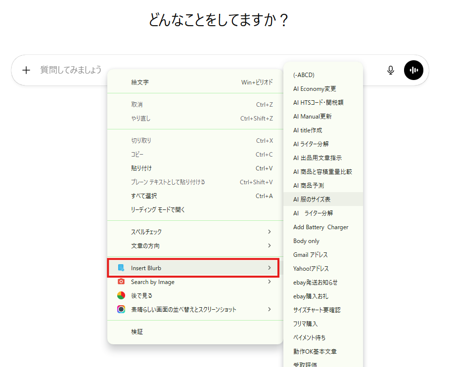
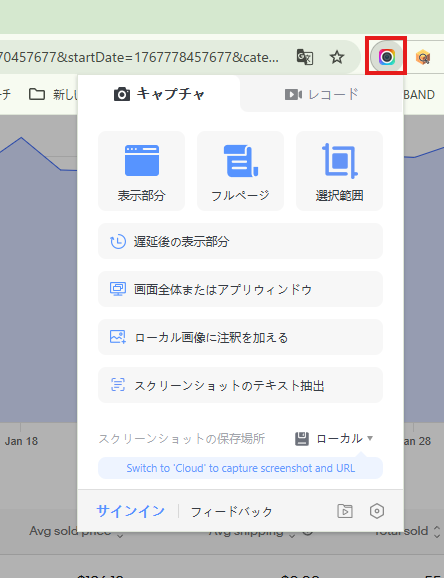
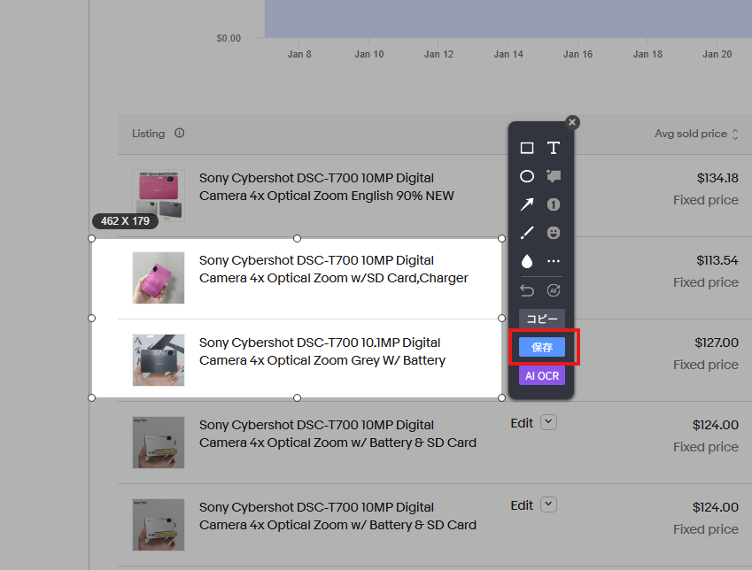
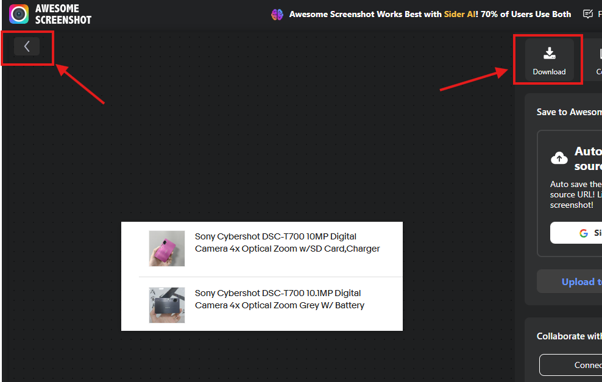

# 各種拡張機能導入

このページでは、リサーチ業務で使用する拡張機能について説明します。  
拡張機能を導入することで、作業効率を大幅に向上させることができます。

---

## 必須拡張機能

🚨 必須導入のお願い

この項目で紹介する拡張機能は、本業務を行う上で必須となります。  
必ず導入をお願いいたします。  

⚠️ 権限付与に関する注意点

※①～③の拡張機能については、こちらで権限を付与しないとストアで「このアイテムはご利用いただけません」と表示されます。  
その際は管理者宛にご連絡をお願いいたします。なお、権限の付与には1～2日ほどお時間をいただく場合がございます。

### ① ebayリサーチサポートツール

<a href="https://chromewebstore.google.com/detail/ebay%E3%83%AA%E3%82%B5%E3%83%BC%E3%83%81%E3%82%B5%E3%83%9D%E3%83%BC%E3%83%88%E3%83%84%E3%83%BC%E3%83%AB/mchciagjfbenagabjikoannekbnphnip" class="chrome-btn" target="_blank" rel="noopener">🧩 Chromeウェブストアで開く</a>

仕入商品の検索作業、商品情報の取得、出品作業の支援を行うツールです。  

※リサーチサポートツールについての詳細は[コチラ](tool_support_setup.md)

---

### ② ebay送料込み価格表示

<a href="https://chromewebstore.google.com/detail/ebay%E9%80%81%E6%96%99%E8%BE%BC%E4%BE%A1%E6%A0%BC%E8%A1%A8%E7%A4%BA/hbeapmbjnjmifoceiibcobffhgppmhge" class="chrome-btn" target="_blank" rel="noopener">🧩 Chromeウェブストアで開く</a>

eBay検索画面で表示される送料を、日本円ではなくドル表示に変更する機能です。  
導入後は特別な操作は不要です。

---

### ③ ebayとテラピークで検索

<a href="https://chromewebstore.google.com/detail/ebay%E3%81%A8%E3%83%86%E3%83%A9%E3%83%94%E3%83%BC%E2%80%8B%E3%82%AF%E3%81%A7%E6%A4%9C%E7%B4%A2/hofiaaloaomnbcimjolifpfgkdgljibi" class="chrome-btn" target="_blank" rel="noopener">🧩 Chromeウェブストアで開く</a>

テキストを選択した状態で右クリックすると、「eBayとテラピークで検索」が表示されます。  
選択したテキストをそのまま検索に使用できます。

---

## おすすめ拡張機能

💡 おすすめツール（任意導入）

こちらは必須ではありませんが、導入することで作業効率が向上します。

### ① Google翻訳

<a href="https://chromewebstore.google.com/detail/google-translate/aapbdbdomjkkjkaonfhkkikfgjllcleb" class="chrome-btn" target="_blank" rel="noopener">🧩 Chromeウェブストアで開く</a>

海外サイトの商品説明や英語ページを翻訳する際に使用します。  
英語ページを閲覧する機会が多いため、導入を推奨します。

---

### ② Insert Blurb

<a href="https://chromewebstore.google.com/detail/insert-blurb/bkoknijjdnlaenldjopbkngkoegfmejf" class="chrome-btn" target="_blank" rel="noopener">🧩 Chromeウェブストアで開く</a>

保存した定型文をワンクリックで挿入できるツールです。  
AIへ定型文の指示を送る場合などに使用します。

※AI活用についての詳細は[コチラ](skill_ai.md)

#### 使い方

- 文章入力欄で右クリック  
- Insert Blurbにカーソルを合わせる  
- 保存した定型文一覧から入力したい文章を選択  

---

### ③ 素晴らしい画面の並べ替えとスクリーンショット

<a href="https://chromewebstore.google.com/detail/awesome-screen-recorder-s/nlipoenfbbikpbjkfpfillcgkoblgpmj" class="chrome-btn" target="_blank" rel="noopener">🧩 Chromeウェブストアで開く</a>

ブラウザ上の指定範囲をスクリーンショットできるツールです。  
不明点が発生した場合、作業画面を共有していただくことで問題をスムーズに解決できます。

#### 使い方

  STEP 01
  拡張機能アイコンをクリック

  STEP 02
  撮影範囲を選択してドラッグ保存

- 撮影範囲を「表示部分」「フルページ」「選択範囲」から選択  
- 撮影したい範囲をドラッグし保存  

  STEP 03
  編集とダウンロード

- 左矢印マークで画像編集が可能  
- 「Done」→「Download」で保存  

