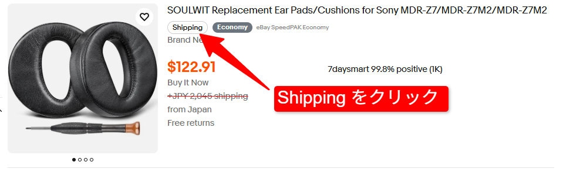

# 各種拡張機能導入

このページでは、リサーチ業務で使用する拡張機能について説明します。  
拡張機能を導入することで、作業効率を大幅に向上させることができます。

---

## 必須拡張機能

この項目で紹介する拡張機能は、本業務を行う上で必須となります。必ず導入をお願いいたします。  

※①・②・③の拡張機能については、こちらで権限を付与しないとストアで「このアイテムはご利用いただけません」と表示されます。  
その際は管理者宛にご連絡をお願いいたします。なお、権限の付与には1～2日ほどお時間をいただく場合がございます。

### ① ebayリサーチサポートツール

👉 [Chromeウェブストアで開く](https://chromewebstore.google.com/detail/ebay%E3%83%AA%E3%82%B5%E3%83%BC%E3%83%81%E3%82%B5%E3%83%9D%E3%83%BC%E3%83%88%E3%83%84%E3%83%BC%E3%83%AB-legacy/fdhefmpbcdkclnleajeldbeafdhemlai)

仕入商品の検索作業、商品情報の取得、出品作業の支援を行うツールです。  

※リサーチサポートツールについての詳細は[コチラ](tool_support_setup.md)

---

### ② ebay送料込み価格表示

👉 [Chromeウェブストアで開く](https://chromewebstore.google.com/detail/ebay%E9%80%81%E6%96%99%E8%BE%BC%E4%BE%A1%E6%A0%BC%E8%A1%A8%E7%A4%BA/hbeapmbjnjmifoceiibcobffhgppmhge)

eBayの検索画面で、通常は日本円で表示される送料をUSドルに変換し、商品価格と合算して表示する機能です。  
送料が合算された金額は「オレンジ色」で表示されます（※送料無料の商品は黒文字のまま表示されます）。導入後の特別な操作は一切不要です。

  表示例 1
  検索結果一覧での合算表示例

  表示例 2
  個別商品ページ内での合算表示例

個別商品ページ内でも同様に合算表示されます。  
※検索結果画面と個別ページで金額に差異が生じる場合がありますが、個別商品ページ内の合算金額が正しい金額です。

---

### ③ eBay配送方法表示ツール（eBay Search Shipping Method Extractor） {: #shipping-extractor }

👉 [Chromeウェブストアで開く](https://chromewebstore.google.com/detail/jkfgbjebhacggddhcdfeabaichfackkh)

eBayの検索結果一覧で、日本の出品者（Japan listings）の商品に対して「Shipping」ボタンを追加する拡張機能です。  
個別商品ページを1つずつ開くことなく、検索一覧画面上でワンクリックで配送方法（配送スピード・配送業者）を確認できます。

#### 使い方

  STEP 01
  「Shipping」ボタンをクリック

eBayの検索結果一覧で、商品タイトルの下に表示される **「Shipping」** ボタンをクリックします。  
配送方法が自動取得され、速度に応じたカラーバッジと詳細な配送方法名が表示されます。

#### 表示される配送アイコン（バッジ）の種類

配送スピードに応じて、以下の4色のバッジで分かりやすく表示されます：

| 表示アイコン | 配送区分 | 配送スピード・主な配送方法 |
| :---: | :---: | :--- |
| Express | 最速便 | FedEx Priority / DHL Express など |
| Expedited | 速達便 | EMS / FedEx International / Expedited Shipping など |
| Standard | 通常便 | ePacket / Standard Shipping など |
| Economy | 小型・格安便 | eBay SpeedPAK Economy / 小型包装物 など |

※バッジの横には、実際の配送設定名（例：`eBay SpeedPAK Economy` など）が小さく表示されます。

---

### ④ Insert Blurb

👉 [Chromeウェブストアで開く](https://chromewebstore.google.com/detail/insert-blurb/bkoknijjdnlaenldjopbkngkoegfmejf)

保存した定型文をワンクリックで挿入できるツールです。  
AIへ定型文の指示を送る場合などに使用します。

※AI活用についての詳細は[コチラ](skill_ai.md)

#### 使い方

- 文章入力欄で右クリック  
- Insert Blurbにカーソルを合わせる  
- 保存した定型文一覧から入力したい文章を選択  

---

## おすすめ拡張機能

こちらは必須ではありませんが、導入することで作業効率が向上します。

### ① Google翻訳

👉 [Chromeウェブストアで開く](https://chromewebstore.google.com/detail/google-translate/aapbdbdomjkkjkaonfhkkikfgjllcleb)

海外サイトの商品説明や英語ページを翻訳する際に使用します。  
英語ページを閲覧する機会が多いため、導入を推奨します。

---

### ② Double Click Image Downloader

👉 [Chromeウェブストアで開く](https://chromewebstore.google.com/detail/double-click-image-downlo/piheafhalbmhiaffagiaehdlnhgphcpd)

保存したい画像の上でダブルクリックするだけで、PCのダウンロードフォルダに画像が保存されます。  
フリマサイトや一部のECサイトでは画像のダウンロードができませんが、この拡張機能を使用することでダウンロードが可能です。  
AI向けプロンプト【[送料・重量の判定](skill_ai.md#2)】の使用時に活用してください。

---

### ③ 素晴らしい画面の並べ替えとスクリーンショット

👉 [Chromeウェブストアで開く](https://chromewebstore.google.com/detail/awesome-screen-recorder-s/nlipoenfbbikpbjkfpfillcgkoblgpmj)

ブラウザ上の指定範囲をスクリーンショットできるツールです。  
不明点が発生した場合、作業画面を共有していただくことで問題をスムーズに解決できます。

#### 使い方

  STEP 01
  拡張機能アイコンをクリック

  STEP 02
  撮影範囲を選択してドラッグ保存

- 撮影範囲を「表示部分」「フルページ」「選択範囲」から選択  
- 撮影したい範囲をドラッグし保存  

  STEP 03
  編集とダウンロード

- 左矢印マークで画像編集が可能  
- 「Done」→「Download」で保存  

