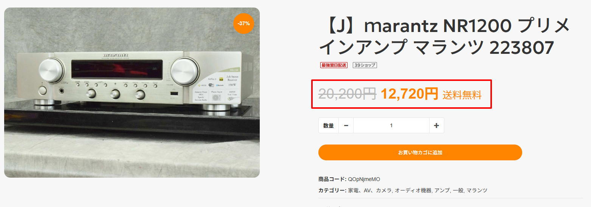
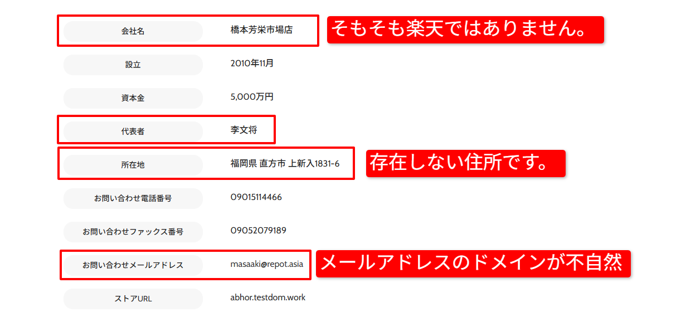
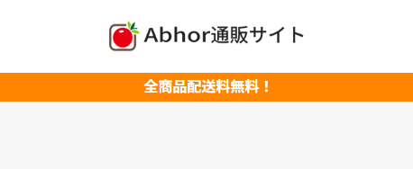
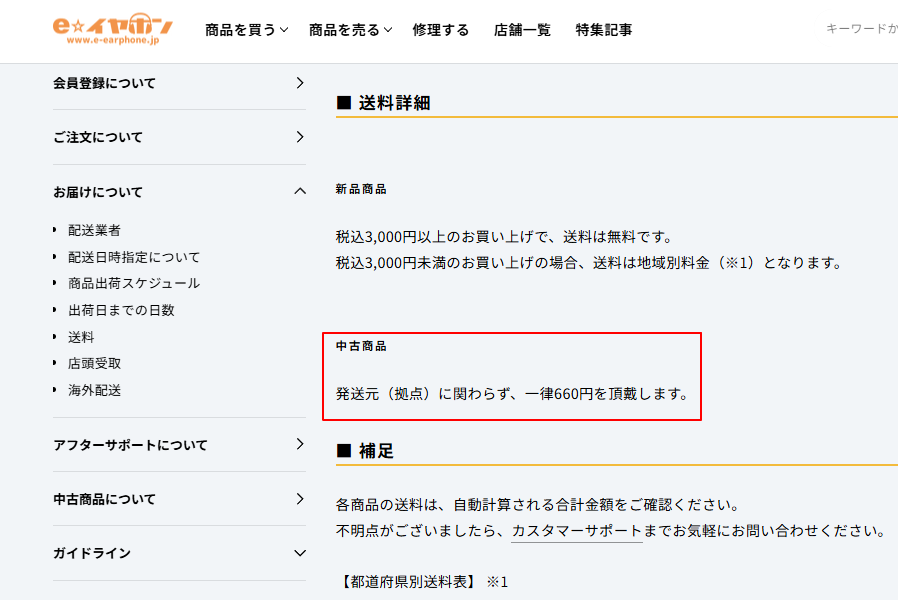
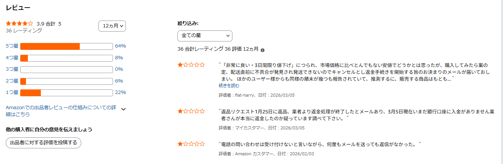
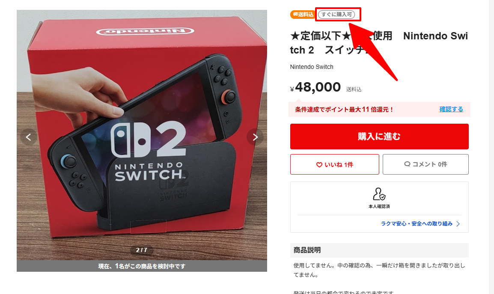
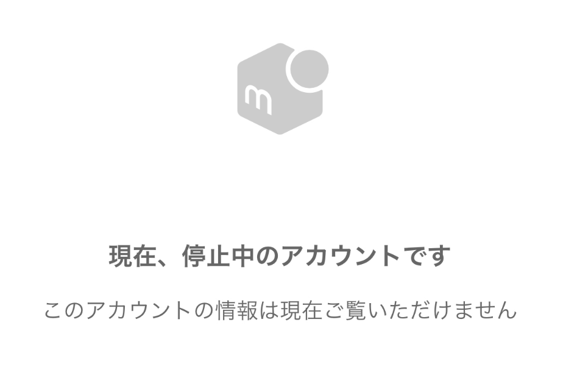
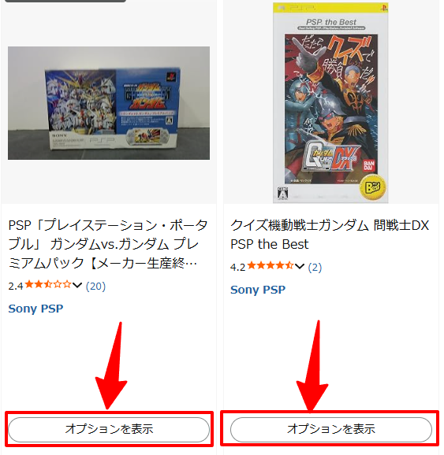
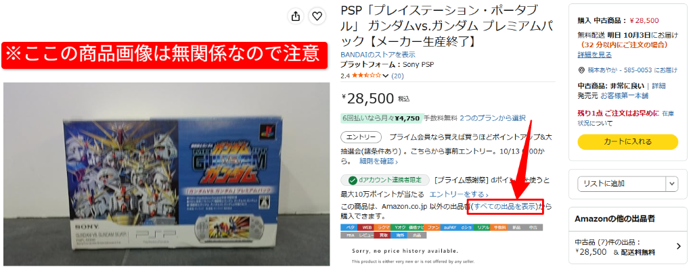
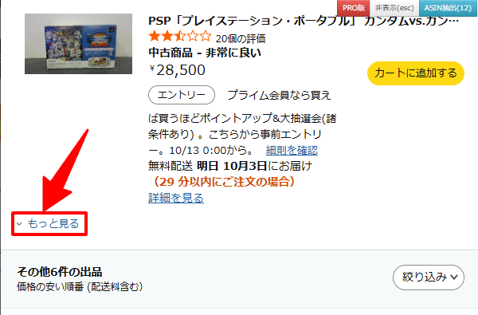

# 仕入れサイトについて

このページでは、リサーチ時に使用する仕入れサイトの注意点について解説します。

無在庫販売では、仕入れ先の選定を誤ると以下のような問題が発生します。

- 商品が購入できない  
- 偽物を仕入れてしまう  
- 発送が遅れる  
- 在庫切れになる  

これらのトラブルを防ぐため、仕入れサイトの特徴を理解しておきましょう。

---

## 詐欺サイトについて

Google検索の「ショッピング」には、通常のショップと詐欺サイトが混在して表示されることがあります。  
そのため、仕入れ先として利用してよいサイトかどうかを判断することが重要です。

詐欺サイトは、以下のポイントを確認することで多くの場合見分けることができます。

### ① 価格が異常に安い

詐欺サイトの最も多い特徴は、相場より極端に安い価格設定です。

多くの場合、以下のような表示がされています。

- 定価に打消し線がついている  
- 大幅な値下げが表示されている  
- サイト内のほぼ全商品が割引されている  

このような場合は詐欺サイトの可能性が高いため注意してください。

### ② 会社概要が不自然

ショップページの「会社概要」や「特定商取引法に基づく表記」も確認しましょう。

以下のような場合は注意が必要です。

- 住所を検索してもGoogleマップに表示されない  
- 会社名が存在しない  
- 代表者名が不自然  

### ③ サイトデザインが簡素

詐欺サイトは短期間で作られることが多いため、サイトの作りが簡素なことがあります。

以下のような特徴がある場合は注意してください。

- ロゴやサイト名が不自然で全体的にチープな作り  
- フリマサイトから流用したような画像が多い  

🚨 詐欺サイトかどうか判断できない場合は、必ず管理者へ相談してください。

---

## フリマサイト以外の注意点

eBayで商品が売れてからの発送期日は10営業日に設定しています。  
購入先を指定する際は、「すぐに購入できる商品である事」を必ず確認してください。

### ① 納期に関して

以下のような商品は、購入・カートに入れるボタンがあっても発送までに時間がかかるため注意が必要です。

- 納期が未定、あるいは数か月先となっている  
- 予約商品  
- 受注生産  

納期についての記載を必ず事前によく確認してください。

### ② 仕入れ価格・送料について

仕入れ先サイトによって、価格や送料の表記ルールが異なります。以下の点に注意してください。

- **税込金額の確認**  
  サイトによっては税抜価格が目立つように大きく書かれ、**税込金額が小さく表示されている**ことがあります。必ず税込金額を仕入れ価格として確認してください。

- **送料の確認**  
  基本的には「送料無料」の明記がない限り送料が発生します。  
  また、新品は送料無料でも「中古品は一律送料が発生する」など、商品の状態によってルールが異なる場合もあります。

送料詳細は、サイトごとの「ご利用ガイド」や「インフォメーション」に記載されていることが多いので、初めて利用するサイトでは必ず事前に確認しましょう。

---

## フリマサイト・中古サイトの注意点

フリマサイトや中古販売サイトでは、1つのプラットフォーム内に複数の販売者が存在します。  
そのため、出品者ごとに信頼性を確認する必要があります。

**【対象となる主なプラットフォーム例】**

- メルカリ  
- ラクマ  
- Amazon  
- 楽天市場  

### ① 出品者の評価を確認する

まず出品者の評価を確認しましょう。以下の点をチェックしてください。

- 評価が極端に低くないか  
- 在庫切れを頻繁に起こしていないか  

安心して購入できる出品者かどうかを判断することが重要です。

判断に迷う場合は管理者へ相談してください。

### ② 偽ブランド商品に注意

フリマサイトでは偽物のブランド商品が出品されている場合があります。

特に以下の特徴がある場合は注意してください。

- ブランド商品が極端に安い  
- 画像の作りが派手すぎる  

ブランド商品を扱う場合は、フリマサイトの絞り込み機能（例：メルカリの「安心鑑定」など）を活用しましょう。

⚠️ 鑑定機能を使用しても完全に安全とは限らないため、不自然に安価な商品は避けてください。

### ③ 商品説明の確認

商品説明と実際の商品状態が一致しているかも重要です。

- 説明では新品と書かれているが、実際の写真では使用感がある  
- コンディションの記載が曖昧  

このような場合は仕入れ対象として適さない可能性があります。

コンディションを確認する際、「通電のみ確認しました」など通電した事のみの記載はジャンク品として扱ってください。  
**必ず「動作確認済み」の記載まで確認をお願いします。**

---

## フリマサイトごとの注意点

### ① ラクマの注意点

ラクマでは、**「すぐに購入可」のアイコンがついている商品のみ**指定してください。

「すぐに購入可」のアイコンが無い商品は、`購入申請` → `販売者が申請を許可` という流れになります。

相場より安く出品しておきながら、申請許可を出さない出品者が後を絶ちませんので注意して確認してください。

### ② メルカリの注意点

  CHECK
  メルカリのアカウント停止チェック

メルカリの場合は商品出品後にアカウントが消去された場合、商品がメルカリに残り続けることがあります。

あまりにも相場がかけ離れていた場合や、出品から数か月経っている場合は「購入手続きへ」を一度押して確認しましょう。

※この操作だけでは決済は行われませんので安心してください。

アカウント停止中はこのような表示になります。

### ③ Amazonの注意点

Amazonの中古品を仕入れ先として指定する際の注意点です。  
（※[リサーチ実践動画](research_steps.md)の17分00秒〜でも解説しています）

中古商品の場合は、**商品ページのTOP画像の商品は届かず**、特定の操作を行わないと実物の画像を見ることができません。  
必ず以下の手順に従って実物の画像とコンディションを確認してください。

#### 確認手順

  STEP 01
  「オプションを表示」をクリック

Amazonの検索結果一覧で中古商品の取り扱いがある場合、**「オプションを表示」** ボタンが表示されますのでクリックします。

  STEP 02
  「すべての出品を表示」をクリック

商品ページを開いたあと、**「すべての出品を表示」** をクリックします。

※商品ページ上部に表示されているTOP画像は出品商品とは無関係（代表画像）ですのでご注意ください。

  STEP 03
  「もっと見る」をクリックして実物画像と説明を確認

出品者一覧が開き、価格の安い順に商品が並びます。ここに載っている商品画像が**実際に届く商品**です。

一番上（最安値）の商品の画像を見たい場合は、**「もっと見る」** をクリックすると確認できます。

**必ず実物画像の確認と商品説明を読んでから仕入れ先に指定してください。**  
 
**リサーチサポートツールの商品情報吸い上げの際はワンクリックに対応していないので、「ページ上の価格を選択して取得」からお願いします。**

