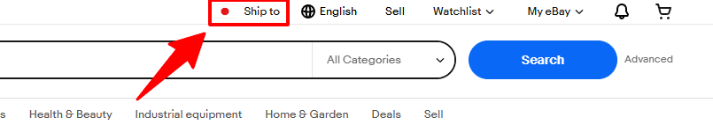
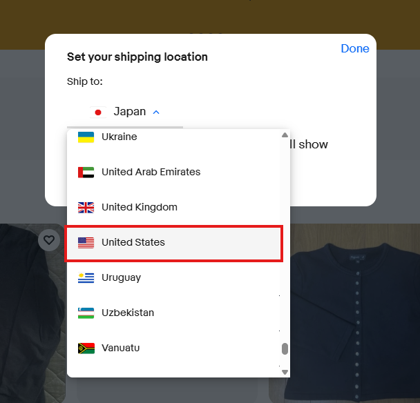
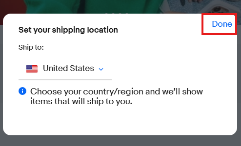

# リサーチを行う前に

このページでは、リサーチを始める前に必ず確認していただきたい重要事項について説明します。  
実践的な詳細については、次のページ以降で動画コンテンツなどを用いて詳しく解説していきます。

---

## 表示言語について

⚠️ 英語表示推奨のお願い

リサーチ時の表示言語は、原則「英語」のままでお願いいたします。

日本語表示にすると、一部ページが正しく翻訳されないことがあり、販売データやフィルター項目の意味を誤って理解してしまう可能性があります。

また、eBayは英語を基準に構成されているため、売れている商品のタイトル構造やSEOの傾向も、英語表示のほうがより正確に把握できます。

リサーチの精度を保つためにも、できるだけ英語表示のまま作業を進めていただけると助かります。

英語が読みにくい場合は、Chromeのページ翻訳機能を一時的に使ったり、Google翻訳の拡張機能で気になる単語だけを調べるなどの方法で対応してください。

英語のプラットフォームではありますが、使っているうちに自然と慣れていきますのでご安心ください。

---

## Ship To の確認

🚨 Ship To（お届け先）の確認は最重要です

「Ship To」の設定によっては、eBay上に商品が表示されなくなる場合があります。

Ship Toとは「商品のお届け先情報」のことです。

お届け先が日本のままリサーチを行うと、  
アメリカ向けの需要データを正しく確認することができません。  
その結果、実際には売れている商品を見逃したり、誤った販売判断につながる可能性があります。

リサーチを行う際には、**必ずShip Toが「アメリカ」になっているか確認**してください。

### 確認方法・設定変更方法

  STEP 01
  画面右上の国旗を確認

画面右上の国旗を確認します。

  STEP 02
  お届け先をアメリカに変更

日本になっている場合は「Ship to」をクリックし、プルダウンから「United States（アメリカ）」を選択します。

  STEP 03
  設定を適用する

「Done」をクリックして適用します。

---

## リサーチの基準

### 利益計算時のルール

リサーチを行う際は、以下の2つのルールに基づいて利益計算を行ってください。

① 日本人出品者の中で最安値を目指す

eBayで主な競合となるのは、同じく日本から出品している日本人セラーです。現在出品されている日本人セラーの販売価格（送料込み）を確認し、その中で最安値を目指して利益計算を行います。ここで計算した価格が、実際の出品価格となります。

② 最安値の「-1ドル」で利益計算を行う

日本人セラーの中で最安値が確認できたら、その価格からさらに**「1ドル下げた価格（-1$）」**で利益計算を行ってください。ライバルより1ドル安く設定することで、購入される確率を大幅に高めることができます。  
（例：現在の日本人最安値が $150 の場合は、$149 で計算）

---

### 利益額が500円以上出るもののみリストアップ対象

🚨 必須基準：利益額500円以上

商品の利益は、仕入れ価格・送料・販売価格などを元に計算しますが、実際の発送時には以下のような要因によって利益が変動する可能性があります。

- 発送時の送料変動  
- 関税や手数料の変動  
- 為替レートの変動  

これらの影響により、リサーチ時の計算上は利益が出ている商品でも、実際には利益が減少したり、赤字になる場合があります。

そのため、利益に余裕を持たせる目的で、この基準を設定しています。

**この基準を必ず守るようにしてください。**

