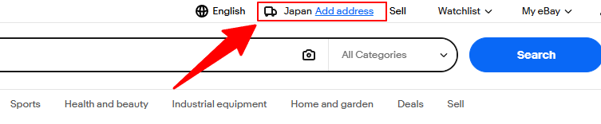
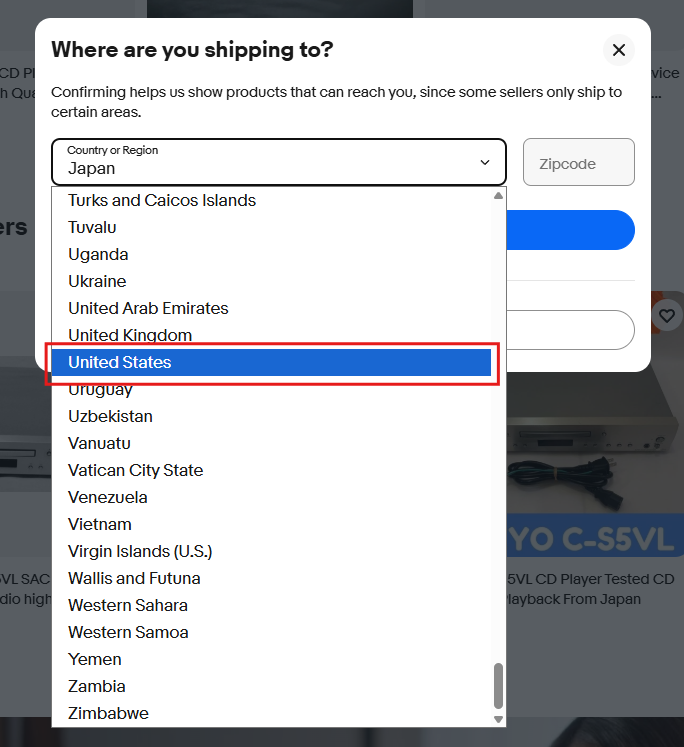
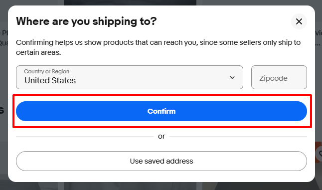
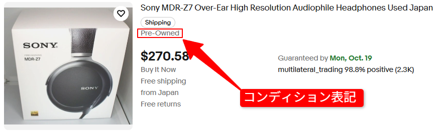

# リサーチを行う前に

このページでは、リサーチを始める前に必ず確認していただきたい重要事項について説明します。  
実践的な詳細については、次のページ以降で動画コンテンツなどを用いて詳しく解説していきます。

---

## 表示言語について

リサーチ時の表示言語は、原則「英語」のままでお願いいたします。

日本語表示にすると、一部ページが正しく翻訳されないことがあり、販売データやフィルター項目の意味を誤って理解してしまう可能性があります。

また、eBayは英語を基準に構成されているため、売れている商品のタイトル構造やSEOの傾向も、英語表示のほうがより正確に把握できます。

リサーチの精度を保つためにも、できるだけ英語表示のまま作業を進めていただけると助かります。

英語が読みにくい場合は、Chromeのページ翻訳機能を一時的に使ったり、Google翻訳の拡張機能で気になる単語だけを調べるなどの方法で対応してください。

英語のプラットフォームではありますが、使っているうちに自然と慣れていきますのでご安心ください。

---

## Ship To の確認

「Ship To」の設定によっては、eBay上に商品が表示されなくなる場合があります。

Ship Toとは「商品のお届け先情報」のことです。

お届け先が日本のままリサーチを行うと、  
アメリカ向けの需要データを正しく確認することができません。  
その結果、実際には売れている商品を見逃したり、誤った販売判断につながる可能性があります。

リサーチを行う際には、**必ずShip Toが「アメリカ」になっているか確認**してください。

### 確認方法・設定変更方法

  STEP 01
  画面右上の国旗を確認

画面右上の国旗を確認します。

  STEP 02
  お届け先をアメリカに変更

日本になっている場合は「Ship to」をクリックし、プルダウンから「United States（アメリカ）」を選択します。

  STEP 03
  設定を適用する

「Done」をクリックして適用します。

---

## リサーチの基準

### 利益額が500円以上出るもののみリストアップ対象

商品の利益は、仕入れ価格・送料・販売価格などを元に計算しますが、実際の発送時には以下のような要因によって利益が変動する可能性があります。

- 発送時の送料変動  
- 関税や手数料の変動  
- 為替レートの変動  

これらの影響により、リサーチ時の計算上は利益が出ている商品でも、実際には利益が減少したり、赤字になる場合があります。

そのため、利益に余裕を持たせる目的で、この基準を設定しています。

**この基準を必ず守るようにしてください。**

---

### 利益計算時のルール

リサーチを行う際は、以下の2つのルールに基づいて利益計算を行います。

① 「条件を満たした」日本人最安値を基準にする

eBayで主な競合となるのは同じ日本人セラーです。ただし、**単純に一番安い商品を選ぶのではなく**、後述する4つの基準を満たしたセラーの販売価格（送料込み）を「正しい最安値」として認識し、利益計算を行います。

② 最安値の「-1ドル」で自動計算

ライバルより安く出品し成約率を高めるため、認定した最安値から「-1ドル」した価格を基準に利益計算を行います。  
※eBayリサーチサポートツール側で自動的に「-1ドル」された状態で利益計算が行われます。作業者側で手動で引き算をする必要はありません。  
（例：最安値が $150 の場合、ツールが自動で $149 として計算します）

---

### 最安値として認定する4つの基準

「どの出品者を最安値のライバルとして認識するか」は、以下の**優先順位①〜④**に沿って判断します。

  優先度 1
  日本人出品者（From Japan）であること

海外セラー（中国やアメリカ等）は除外します。必ず**「From Japan」の日本人セラーのみ**をライバル対象とします。

  優先度 2
  配送方法が「Expedited」以上であること

[eBay配送方法表示ツール](env_extensions.md#shipping-extractor) の「Shipping」ボタンをクリックし、表示される配送バッジを確認します。

- ◯ **最安値の対象（認定）**  
  Express 最速便 ／ Expedited 速達便
- ✕ **除外（最安値として扱わない）**  
  Standard 通常便 ／ Economy 小型・格安便

※StandardやEconomyを使っているセラーがどれだけ安く出品していても、**配送スピードが遅いためライバル最安値からは除外（無視）** します。私はExpeditedの配送方法で勝負するため、遅いセラーに無理に価格を合わせる必要はありません。

  優先度 3
  コンディション（状態）の一致

コンディションは大きく**「新品」「中古」「ジャンク」の3パターン**に分けて考え、仕入れ対象の商品と同じ区分のものを最安値として認定します。  
（例：仕入れ先が「中古良品」なのに、eBayの「ジャンク品」を最安値にしてしまうと価格が合いません）

| コンディション区分 | eBay上の主な表記例 | 判定の目安 |
| :---: | :--- | :--- |
| **新品** | `Brand New` `New` `New with box` `New without tags` `Open box` など | 未使用品・未開封品・開封のみの新品 |
| **中古** | `Like New` `Pre-owned` `Used` `Refurbished`（認定再生品）など | 通常の中古品・美品・動作確認済みのもの |
| **ジャンク** | `For parts or not working` `Parts only` `Junk` など | 故障品・部品取り用・動作未確認のもの |

  優先度 4
  付属品の一致（箱の有無は特に注意）

付属品の有無も加味して最安値を判断します。  
ただし、付属品の完全一致をルール化しすぎるとリサーチが難しくなってしまうため、**柔軟に（ケースバイケースで）判断してOK**です。以下の重要ポイントを押さえてください。

**ポイント１：箱の有無**  
**「箱あり」と「箱なし」では、価値が新品と中古くらい大きく変わります。**  
仕入れ商品が「箱付き」の場合、eBay上の「箱なし（本体のみ）」の格安出品に無理に価格を合わせる必要はありません。

**ポイント２：買い手目線を持つ**  
「厳格な一致」にこだわりすぎず、**『もし自分が買い手（バイヤー）なら、この付属品の状態で、どのくらいの価格差なら買いたいと思うか？』** を考えるクセをつけてみてください。  
付属品が充実している商品は、本体のみの商品よりも高く売れるのがeBayの基本です。

