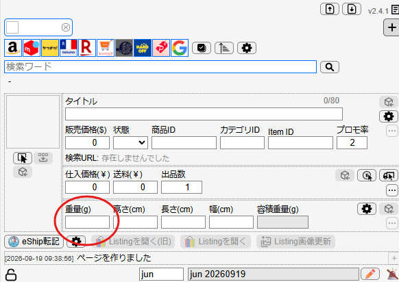

# 利益計算と送料の考え方（AI活用）

本項では、利益計算の仕組みと、**AIを活用した送料・重量の自動判定手順**について解説します。

複雑な計算やサイズ測定はAIが自動で行いますが、正しい数値をツールに入力するために全体の流れを理解しておきましょう。

---

## 送料の基本

当ストアの海外発送では、eBay公式の配送サービス**「eBay SpeedPAK」**を利用します。  
「SpeedPAK」は配送プログラムの名称であり、実際の運送は主に **FedEx や DHL** といった民間の大手国際輸送業者が行っています。

### 送料が決まる仕組み

送料は以下の2つの要素で決まります。

1. **配送地域（国・エリア）**  
   世界約190か国が地域ごとにグループ分けされており、お届け先によって基本料金が異なります。

2. **課金重量（重い方を採用）**  
   送料は「重量課金制」となっており、以下の<span class="red-text">いずれか重い方の数値</span>に基づいて決定されます。

・**実重量**：商品と梱包材を合わせた「実際の重さ」  
・**容積重量**：荷物のサイズを重さに換算したもの（`縦 × 横 × 高さ ÷ 5000`）  
<span class="red-text">※すべての商品でどちらか重い方が採用されるため、ぬいぐるみや箱付きフィギュアなど「軽くてかさばる商品」は、実際の重さ以上に送料が高くなりやすい点に注意してください。</span>

### Pak（専用袋）による送料の節約

薄型・小型の商品については、**専用袋（Pak）**を使うことで、<span class="red-text">箱発送よりも大幅に安く送ることができます。</span>

---

## AIを使った送料・重量判定の手順

ChatGPTなどのAIツール（ChatGPT、Claude、Geminiなど）に以下のプロンプトをコピーして使用します。

```text
# 入力情報
- 商品：
- 箱サイズ3辺cm(新品、中古箱ありの場合)：

---

【あなたは越境EC(eBay)のリサーチ作業を補助する「送料判定アシスタント」です。
上記「入力情報」をもとに、必ずWeb検索ツールを実行して一次情報（公式スペック、カタログアーカイブ、取扱説明書等）を確認し、現場の梱包実務ルールに厳密に従って出品ツールへの入力値を判定してください。】

# 判定ルール
## 1. スペック情報の特定・検証（最重要）
- 必ずWeb検索を実行し、推測や内部記憶だけで数値を決定しないこと。
- スペックの特定時は原則として2箇所以上の独立した信頼できる情報源（メーカー公式、カタログアーカイブ、専門DB等）を照合し、数値が一致していることを確認した上で採用すること。
- 確認した「情報ソース名」および「参照URL」（原則2箇所以上）を必ず出力に記載すること。実在を確認していないURLの生成・提示は厳禁。
- メーカー公式等で「製品重量」と「梱包重量（パッケージ重量）」が別々に記載されている場合、箱サイズ指定（箱あり）であれば「梱包重量」を採用すること（二重加算は厳禁）。
- 梱包前まとまりサイズ(縦×横×高さ cm)：
  ※「箱サイズ3辺cm」に入力がある場合：その数値を最優先で元箱外寸として採用。
  ※空欄（箱なし）の場合：本体と各付属品に緩衝材(プチプチ1周)を巻いた状態で、段ボール内のデッドスペースが最小になるよう隙間なく組み合わせた「全体のまとまりサイズ(直方体)」を想定して算出すること。

## 2. 実重量の計算
実重量 ＝ 総商品重量(g) × 1.20
※梱包資材・緩衝材マージンとして一律1.20倍を適用（端数四捨五入）。

## 3. 発送種別の判定（現場実務ルール）
以下の優先順位で発送方法を判定する。

### 【判定A：Pak / Envelope発送】
以下の条件をすべて満たす場合はPak/Envelope発送とする（容積計算は不要、実重量を採用）。
① 実重量(×1.20後)が 2.5kg(2500g) 以内
② 梱包種別とサイズ条件：
   - Envelope/薄型Pak (アクセサリ、時計、ゲームソフト、カフス、薄型小物等)：
     厚み5cm以内 かつ 実重量500g以内
   - 通常Pak (衣類、ぬいぐるみ、日用パウチ等)：
     各辺+3cmの梱包見込み容積が 15,400cm³ 以内
   - 箱パック (小型精密機器・壊れ物：小型カメラ、イヤホン、ハンディカム、マグカップ1個等)：
     梱包前まとまりサイズ(各辺+5cm後)の容積が「7,500cm³以内（目安：24×17×16cm程度）」に収まるならPak発送可能。

### 【判定B：箱発送】（Pakの条件を超えた場合）
Pakに収まらない中型〜大型商品はすべて箱発送とし、外箱サイズを加算して容積重量を算出・比較する。
★加算ルール：
- 「箱サイズ3辺cm」に入力がある場合：品目に関わらず入力サイズから一律【各辺＋5cm】を梱包外箱サイズとする。
- 「箱サイズ3辺cm」が空欄（箱なし）の場合：
  - 壊れやすい商品(大型機材、オーディオ、据置ゲーム機、デッキ等)：梱包前まとまりサイズの各辺に ＋7cm
  - 壊れにくい商品：梱包前まとまりサイズの各辺に ＋5cm
- 容積重量(g) ＝ 加算後の 縦(cm) × 横(cm) × 高さ(cm) ÷ 5
- 比較判定：実重量(g) と 容積重量(g) のうち【大きい方の数値】を最終採用重量とする。

## 4. 禁止事項
- Web検索を行わずに記憶や推測でサイズ・重量を算出すること。
- 複数ソースでの照合を怠り、単一の不確かな情報のみで数値を確定させること。
- 架空のURLを生成すること（検索結果で実際にアクセス・確認できたURLのみ記載すること）。
- メーカーの「製品重量」と「梱包重量」を両方足して二重計上すること。
- 付属品の厚みや配置スペースを無視して本体サイズのみで計算すること。
- ルール外の独自補正を行うこと。

# 出力形式
0. 特定したスペック・商品情報：
   - ブランド／メーカー：
   - 本体サイズ・重量(公式値)：○×○×○cm / ○g
   - 確認ソース(参照URL)：(照合した2箇所以上のサイト名とURLを直接リンク形式で記載)
   - 総商品重量(本体+付属品)：約○g (※梱包重量採用時はその旨を記載)
   - 梱包前まとまりサイズ：約○×○×○cm (本体＋付属品を最小空間で配置したサイズ、または入力された箱サイズ)

1. 発送区分：Envelope/薄型Pak ／ 通常Pak ／ 箱パック ／ 箱発送
   - 判定理由：(簡潔に1行)

2. 計算メモ：
   - 実重量：○g × 1.20 ＝ ○g
   - (箱発送時のみ) 梱包サイズ：○×○×○cm → 容積重量：○g (比較：実重量 ○g vs 容積重量 ○g → ○g採用)

3. 一言補足情報：
   (AIから外注さんへの確認メッセージ。発売時期、製品の概要、主な用途などを1〜2行で記載)

━━━━━━━━━━━━━━━━━━━━
▼ 外注さん入力用（ツール転記用）
━━━━━━━━━━━━━━━━━━━━
【重量(g)】：○
```

---

### STEP① プロンプト冒頭の「# 入力情報」を記入
上記のプロンプトをAIのチャット欄に貼り付け、**冒頭の「# 入力情報」** に商品情報と箱サイズを記入します。

- **商品**：商品名、型番、付属品（ケーブル、リモコン等）を記入します。
- **箱サイズ3辺cm(新品、中古箱ありの場合)**：仕入れ元ページに元箱の3辺サイズ記載がある場合に入力します。箱なしの場合や不明な場合は**空欄のまま**で構いません。

> **記入例（箱あり・サイズ判明時）：**  
> `- 商品：SONY PS3 CECH-4000 付属品完備`  
> `- 箱サイズ3辺cm(新品、中古箱ありの場合)：34x34x16`  
>  
> **記入例（箱なし・本体のみ）：**  
> `- 商品：カシオ G-SHOCK DW-5600 本体のみ 箱なし`  
> `- 箱サイズ3辺cm(新品、中古箱ありの場合)：`

### STEP② 仕入れ先の商品画像を添付
仕入れ先サイトの商品画像を **1〜2枚程度** 添付します。
- 商品本体
- 付属品（ケーブル、説明書、リモコンなど）
- 外箱の有無

がひと目で分かる画像を添付すると、AIの判定精度が格段に上がります。

### STEP③ 出力された「確認ソース(参照URL)」を確認（違和感チェック）

AIが判定結果を出力したら、「0. 特定したスペック・商品情報」の<span class="red-text">確認ソース(参照URL)</span>を必ず確認してください。  
AIが認識した商品と、実際のリサーチ対象商品にズレがないかをチェックします。

<span class="red-text">※仕入れ元商品と全く違う商品の情報が提示されていないか必ず確認してください。</span>  
AIはWeb検索を行って調査しますが、まれに型番の読み間違いや異なる世代の製品（例：PS3の初期型と最終型を混同するなど）と誤認することがあります。

<span class="red-text">明らかに仕入れ元商品と違う製品情報になっている場合</span>は、型番やメーカー名を詳しく追記して再度判定させてください。

### STEP④ 【重量(g)】をツールに転記

出力の最下部にある **【重量(g)】** の数値を、リサーチサポートツールの重量入力欄にそのまま転記します。


