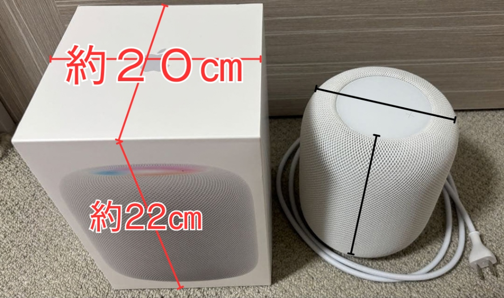
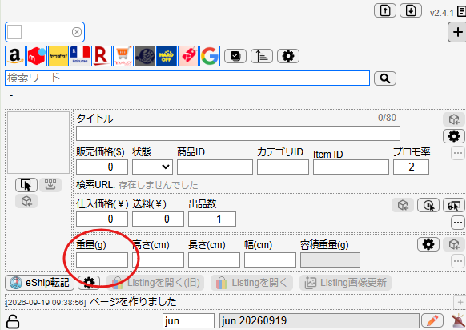

# 利益計算と送料の考え方（AI活用）

本項では、利益計算の仕組みと、**AIを活用した送料・重量の自動判定手順**について解説します。  
複雑な計算やサイズ測定はAIが自動で行いますが、正しい数値をツールに入力するために全体の流れを理解しておきましょう。

---

## 送料の基本

当ストアの海外発送では、eBay公式の配送サービス**「eBay SpeedPAK」**を利用します。  
「SpeedPAK」は配送プログラムの名称であり、実際の運送は主に **FedEx や DHL** といった民間の大手国際輸送業者が行っています。

### 送料が決まる仕組み

送料は以下の2つの要素で決まります。

1. **配送地域（国・エリア）**  
   世界約190か国が地域ごとにグループ分けされており、お届け先によって基本料金が異なります。

2. **課金重量（重い方を採用）**  
   送料は「重量課金制」となっており、以下のいずれか重い方の数値に基づいて決定されます。

⚖️ 実重量

商品と梱包材を合わせた**「実際の重さ」**です。

📦 容積重量

荷物のサイズを重さに換算した数値です。  
`縦 × 横 × 高さ ÷ 5000`

⚠️ すべての商品で<strong>「実重量」と「容積重量」の重い方が採用</strong>されるため、ぬいぐるみや箱付きフィギュアなど<strong>「軽くてかさばる商品」は、実際の重さ以上に送料が高くなりやすい</strong>点に注意してください。

### Pak（専用袋）による送料の節約

薄型・小型の商品については、<strong>専用袋（Pak）</strong>を使うことで、箱発送よりも大幅に安く送ることができます。

---

## AIを使った送料・重量判定の手順

商品の重量や送料区分の判定には、AI（ChatGPT、Geminiなど）を使用します。

👉 **[使用するプロンプト全文はこちら（AI活用：② 送料・重量の判定）](skill_ai.md#2)**  
（※拡張機能「Insert Blurb」に登録しておくと、右クリックからワンクリックで呼び出せます）

---

  STEP 01
  プロンプト冒頭の「# 入力情報」を記入

プロンプトをAIのチャット欄に貼り付け、冒頭の「# 入力情報」 に商品情報を記入します。

- **商品**：商品名、型番、付属品情報などを記入します
- **箱サイズ3辺cm(新品、中古箱ありの場合)**：新品の商品や、箱付き中古品の場合に入力します。箱なしの場合は空欄のままで構いません。

**記入例（箱あり）：**  
- 商品：オムロン(OMRON) HBF-702T 体重体組成計  
- 箱サイズ3辺cm(新品、中古箱ありの場合)：33x30x5  

**記入例（箱なし）：**  
- 商品：カシオ G-SHOCK DW-5600 本体のみ 箱無し  
- 箱サイズ3辺cm(新品、中古箱ありの場合)：  

🔍 箱のサイズが調べても分からない場合の推測方法

製品の箱のサイズが調べても分からなかった場合は、**Googleの画像検索やフリマサイトから同一商品を検索し、画像から箱のサイズを推測**してください。

**【推測の例：Apple HomePod（第2世代）の場合】**  
本体サイズが「高さ: 16.8 cm、幅（直径）: 14.2 cm」なので、下図のように本体と外箱を比較すると、おおよそ **20cm × 20cm × 24cm** 程度と推測できます。

  STEP 02
  仕入れ先の商品画像を添付

仕入れ先サイトの商品画像を **1〜2枚程度** 添付します。

- 商品本体
- 付属品（ケーブル、説明書、リモコンなど）
- 外箱の有無

がひと目で分かる画像を添付すると、AIの判定精度が格段に上がります。

  STEP 03
  出力された「確認ソース(参照URL)」を確認（違和感チェック）

AIが判定結果を出力したら、「0. 特定したスペック・商品情報」の確認ソース(参照URL)を必ず確認してください。  
AIが認識した商品と、実際のリサーチ対象商品にズレがないかをチェックします。

- ※仕入れ元商品と全く違う商品の情報が提示されていないか必ず確認してください。
- AIはWeb検索を行って調査しますが、まれに型番の読み間違いや異なる世代の製品（例：PS3の初期型と最終型を混同するなど）と誤認することがあります。
- 明らかに仕入れ元商品と違う製品情報になっている場合は、型番やメーカー名を詳しく追記して再度判定させてください。

  STEP 04
  【重量(g)】をツールに転記

出力の最下部にある **【重量(g)】** の数値を、リサーチサポートツールの重量入力欄にそのまま転記します。

