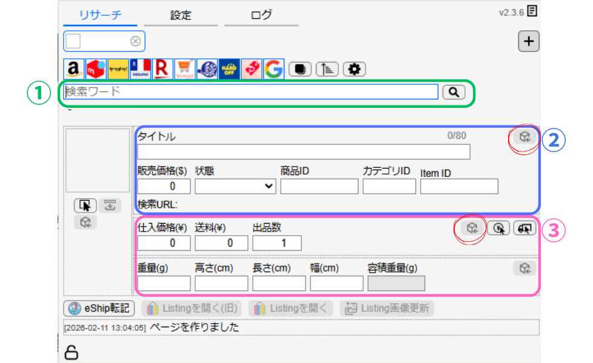

# リサーチサポートツール

本項では、リサーチサポートツールの導入方法と使用方法について解説します。

---

## 画面構成の全体像

まずはリサーチサポートツールの画面構成を確認します。  
（各エリアの役割はこの後の手順説明で詳しく解説します）

  ①
  国内仕入れ先検索エリア

国内の仕入れ先を検索する際に使用します。  
この検索ワード欄にキーワードを入力すると、上部に並んでいる各サイトのアイコンから同時検索を実行し、検索結果を複数タブで開きます。

  ②
  eBay商品情報取得エリア

eBayの最安値商品の情報を入力する箇所です。  
eBayで最安値の商品ページを開いた状態で、赤で囲ったアイコンをクリックすると、必要な商品情報を自動で取得し、販売価格を「-1ドル」で自動設定します。

  ③
  国内仕入れ情報入力エリア

国内仕入れ先サイトの商品ページを開いた状態で、赤で囲ったアイコンをクリックすると、仕入れ価格などの情報が自動入力されます。

重量(g)はAIで判定し、手入力を行います。

---

## 導入～初期設定　解説

導入から初期設定までを解説しています。

<iframe width="100%" height="420"
src="https://www.youtube.com/embed/TMnt41C94Rg"
frameborder="0"
allowfullscreen>
</iframe>

---

## 使い方動画

リサーチサポートツールの使い方を解説しています。  
必要に応じて2倍速などでご確認ください。

<iframe width="100%" height="420"
src="https://www.youtube.com/embed/f6TJrUXMtrI"
frameborder="0"
allowfullscreen>
</iframe>

